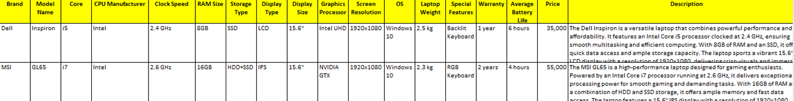
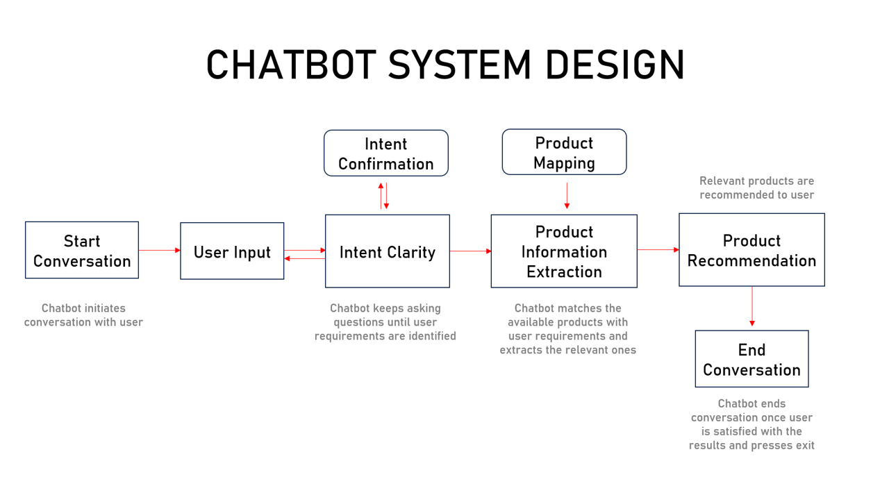
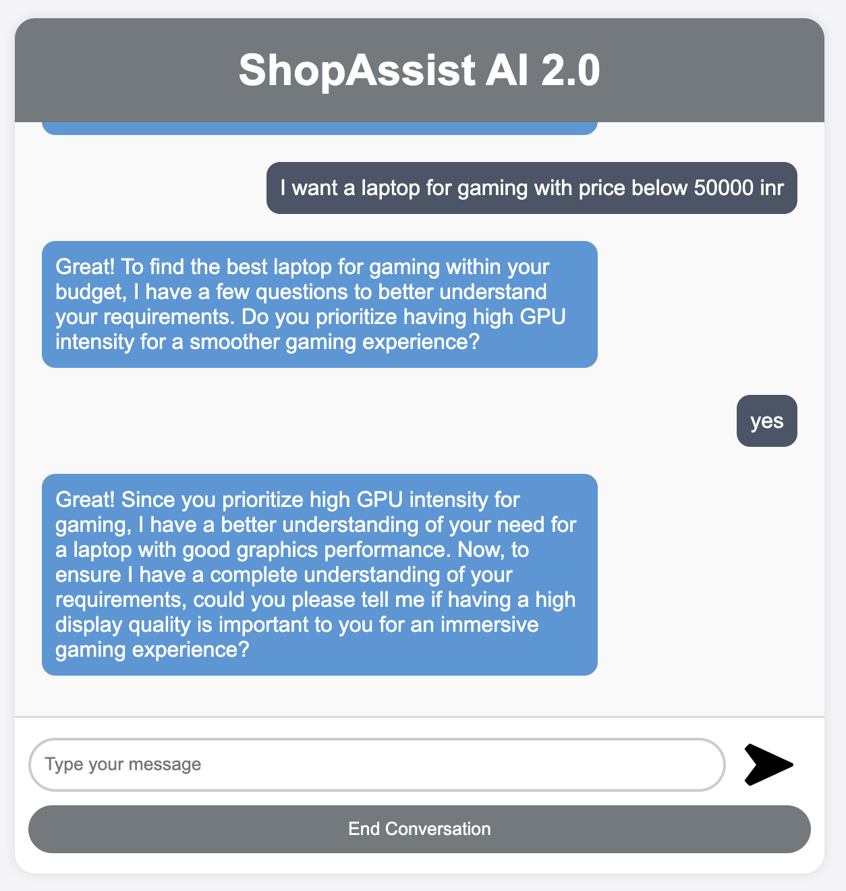
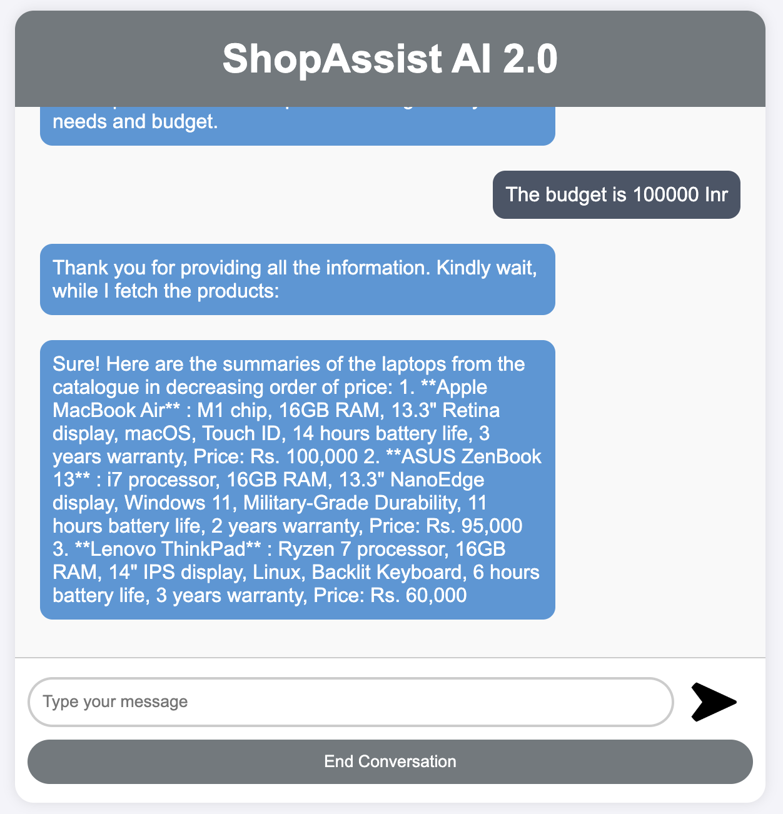

# Shopping Assistant Assignment

## 1. Background

In today’s digital age, online shopping has become the preferred option for many consumers. However, the vast array of
choices and the lack of personalised assistance can make the shopping experience overwhelming and challenging. To
address this issue, we present ShopAssist AI. This chatbot combines the power of LLMs and rule-based functions to
provide accurate and reliable recommendations during the online laptop shopping experience.

## 2. Problem Statement

Given a dataset containing laptop information (product names, specifications, descriptions, etc.), aim is to build a
chatbot that
parses the dataset and provides accurate laptop recommendations based on user requirements. This chatbot is named
ShopAssist AI, and will

- Interact with users,
- Understand their laptop requirements and
- Recommend the most suitable laptops from a dataset based on their needs and preferences.

## 3. Dataset

1. Dataset are defined as below
   
2. The data file can be found [here](chatbot/laptop_data.csv)

## 4. Approach

1. **Conversation and Information Gathering:** The chatbot will utilise language models to understand and generate
   natural responses. Through a conversational flow, it will ask relevant questions to gather information about the
   user’s requirements.
2. **Information Extraction:** Once the essential information is collected, rule-based functions come into play,
   extracting the top three laptops that best match the user’s needs.
3. **Personalized Recommendation:** Leveraging this extracted information, the chatbot engages in further dialogue with
   the user, efficiently addressing their queries and aiding them in finding the perfect laptop solution.

## 5. System Functionalities

- **User Interface:** The ShopAssistAI platform features an intuitive web interface that allows users to engage
  seamlessly with the conversational AI assistant.
- **Conversational AI:** At the heart of this system is the conversational AI, which leverages OpenAI's chat model to
  guide users by asking appropriate questions and discerning their specific needs.
- **User Input Moderation:**  To ensure a secure conversational environment, each inputs are regulated through OpenAI's
  moderation API.
- **User Profile Extraction:** The AI assistant collects vital information during the conversation to
  construct a user profile that accurately represents their laptop preferences, including budget, display quality,
  processing power, portability etc. utilizing OpenAI's function calling mechanism to convert user requirement strings
  into JSON format.

The dataset  [laptop_data.csv](./chatbot/laptop_data.csv) includes rows that detail the specifications of each laptop,
with a concise
description provided at the end of each entry. The chatbot will employ large language models to interpret the
`Description` column and generate recommendations.

## 6. System Architecture

ShopAssistAI operates on a client-server architecture. Users engage with a web interface that is hosted on a server
utilizing the Flask application. This application communicates with OpenAI's API to facilitate conversation generation
and moderation, while also accessing and comparing laptop data from an external database.




## 7. Implementation Details

The Flask application utilizes various functionalities:

- **Routing:** Routing directs user requests to the relevant functions according to the specified URLs.
- **Conversation Management:** Oversees the initiation of conversations, the generation of
  responses utilizing OpenAI's chat model, and the maintenance of conversation history.
- **User Input Processing:** User Input Processing involves capturing user input, conducting moderation checks, and
  extracting user profiles from the conversation history, which includes converting the user input string into JSON
  format through OpenAI Function calling.
- **Recommendation Logic:** It assesses user profiles against laptop data, verifies the validity of recommendations,
  and produces the corresponding recommendation text

  ### Major Functions
- `initialize_conversation()`: Initializes the variable conversation with the system message.
- `get_chat_completions()`: Takes the ongoing conversation as the input and returns the response by the assistant.
- `moderation_check()`: Checks if the user's or the assistant's message is inappropriate. If any of these is
  inappropriate, it ends the conversation.
- `intent_confirmation_layer()`: Evaluates if the chatbot has captured the user's profile clearly.
- `dictionary_present()`: Checks if the final understanding of the user's profile is returned by the chatbot as a Python
  dictionary.
- `compare_laptops_with_user()`: Compares the user's profile with the different laptops and comes back with the top 3
  recommendations.
- `initialize_conv_reco()`: Initializes the recommendations conversation.

  ### Prerequisites

- Python 3.7+
- Please ensure that you add your OpenAI API key to the empty text file named "OpenAI_API_Key" in order to access the
  OpenAI API.

## 8. Getting Started

To begin utilizing ShopAssist AI, please proceed with the following instructions.

1. **Clone the repository**
   ``` shell
   $ git clone https://github.com/SanjayaKumarSahoo/shop-assist-ai
   ```
2. **Enable the virtual environment**
    ```shell
    $ source venv/bin/activate 
    ```

3. **Install dependencies**
    ```shell   
    $ pip install -r requirements.txt
    ```

4. **Initialize the chatbot**
    ```
    $ flask run
     # or
    $ python3 app.py
    ```

## 9. Few chatbot screenshots


